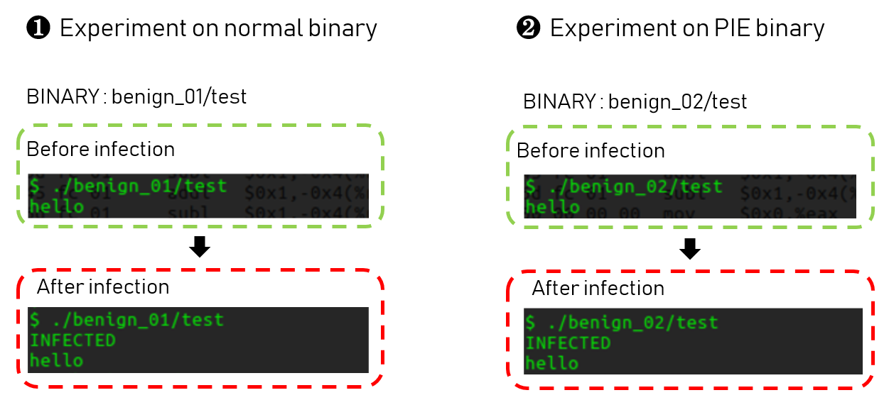
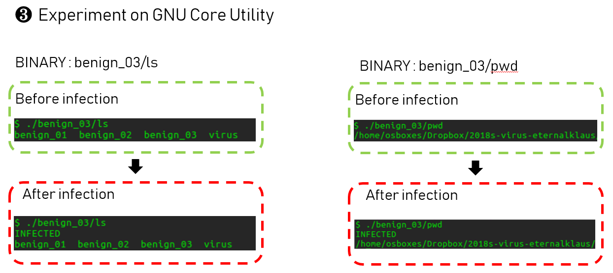

# Eternalvirus
### Author
Jiwon Choi (eternalklaus)  
*Softsec Lab, KAIST GSIS, Korea*  
<br>
<br>
# Deliverables
- Virus source code : src/virus.c
- Encrypted deliverable file : bin/virus.gpg
- Benign file : all files at `bin/benign_0*`
<br>
<br>
  
# About Eternalvirus
### Features
`Eternal virus` has features like below
  
1. `Eternalvirus` runs on x64 linux environment. 
2. `Eternalvirus` can infect linux binaries, including PIE binaris.
3. `Eternalvirus` can infect complicated binary such as `GNU Core Utils`. 
4. `Eternalvirus` bypasses Antivirus by using anti-debugging technique.
<br>
<br>  
  
### How It Works?
Assume that `Eternalvirus` is infecting `pwd` binary.
1. `Eternalvirus` expands `<.text>` size of infected binary by manipulating its ELF header. 
2. `Eternalvirus` injects malicious routine to `pwd`'s expanded `<.text>` section. 
3. `Eternalvirus` manipulates EP(Entry point) of `pwd` to start of malicious routine. 
4. `Eternalvirus` inserts `jmp OEP(Original entry point)` commend at the end of malicious routine. 
5. Infected `pwd` runs normal behavior after executing injected malicious routine.
<br>
<br>

### Chanllenges
1. `text` 섹션에 시그니쳐를 넣어 감염되었음을 나타내어 중복감염을 방지했습니다. 
2. 감염된 바이너리가 OEP에 뛰기 전에 `malicious routine`을 실행하게 되는데, 이때 OEP에 진입할때 필요한 레지스터값들이 손상됩니다. 간단한 바이너리들은 레지스터값들이 손상되도 문제없지만, complicate binary들은 크래시가 납니다. 따라서 malicious routine을 실행하기 전에 레지스터값들을 백업하고, OEP에 점프하기전에 이를 restore하는 루틴을 추가하였습니다. 
3. PIE 바이너리의 경우 text섹션의 address가 실행할때마다 바뀝니다. 따라서 감염된 바이너리는 이를 실행시간에 동적으로 구해서 점프하도록 처리했습니다. 
4. OEP에 리턴할때, 스택에 OEP를 저장하고 main 안에서 단순히 return하는 방식은 reliable하지 않습니다. 세상에는 많은 종류의 바이너리들이 있고 함수의 prolog가 미묘하게 다릅니다. 그래서 스택의 어떤위치가 return주소인지 reliable하게 define할수 없기 때문에 리턴주소를 스택에 박아버리면 위헙합니다. 이런 문제는 `malicious routine` 마지막에 OEP로 jmp하도록 어셈블리단에서 패치함으로써 해결했습니다. 
5. malicious routine 에서는 .bss영역같은 data section은 사용할 수 없습니다. 그래서 모든 데이터들을 스택에 임시저장해서 사용하는 방법을 택했습니다. 
<br>
<br>  

# How to use Eternalvirus?

### Usage

1. Download source code.
```
$ git clonehttps://github.com/eternalklaus/2018s-virus-eternalklaus.git
```

2. Compile `Eternalvirus` 
```
$ make
```

3. Move to `bin` directory, which have sample benign binaries, and execute the virus. 
```
$ cd bin; ./virus
```
<br>
<br>

### Result
`Eternalvirus` infects all binaries undes `./bin`. 
So binaris below are now infected. 

```
- bin/benign_01/test : 64bit test binary (Normal binary)
- bin/benign_02/test : 64bit test binary (*Position Independent Executable*)
- bin/benign_03/*    : 64bit CoreUtils binary
```
<br>
<br>

### What does infected binaries do?
Infected binaries do three things.
1. It prints string `INFECTED`. 
2. And It also infects other binaries like original `Eternalvirus`. 
3. After that, It runs binaries original behavior, and terminates.

<br>
<br>

### Result image

Below images show how the infected binaries runs.

  
  


