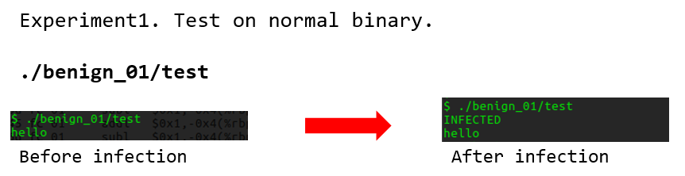
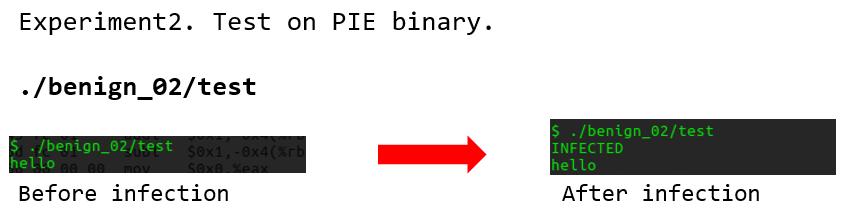

# eternal virus

This is a proof-of-concept virus written in class
[IS-521](https://github.com/KAIST-IS521/) at KAIST.

### Author

Jiwon Choi (eternalklaus)

# 바이러스를 실행해보자!

### 사용법

1. 소스파일을 다운받습니다. 
$ git clone https://github.com/KAIST-IS521/2018s-virus-eternalklaus.git

2. virus 파일을  컴파일합니다. 
$ make

3. bin 폴더로 이동하여 바이러스를 실행합니다. 
$ cd bin; ./virus

### 결과
바이러스는 바이러스가 위치한 디렉터리 하위의 바이너리 파일들을 모두 감염시킵니다. 
따라서 아래 파일들이 바이러스에 감염됩니다!   
- bin/benign_01/test : 64bit test binary (Normal binary)
- bin/benign_02/test : 64bit test binary (*Position Independent Executable*)
- bin/benign_03/*    : 64bit CoreUtils binary
 
감염된 바이너리는 3가지의 작업을 수행합니다.
1. 우선은 감염되었음을 알리는 문자열 INFECTED 를 출력합니다. 
2. virus와 마찬가지로 다른 바이너리들을 감염시킵니다. 
3. 바이너리 본연의 작업을 수행하고 종료합니다. 

# 바이러스 동작 원리?
Malicious routine consists below.
[01] Save register context
[02] Total malicious code
[03] Restore register context and jump to OEP 

